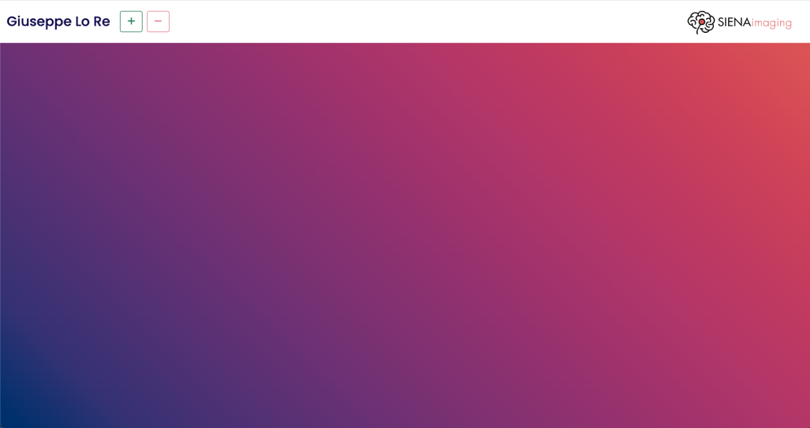
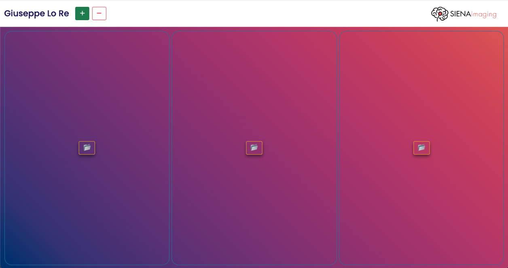
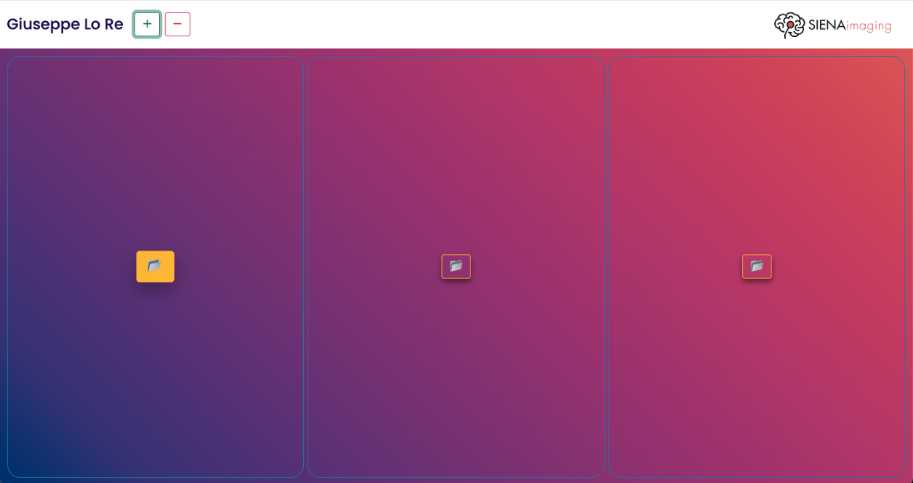
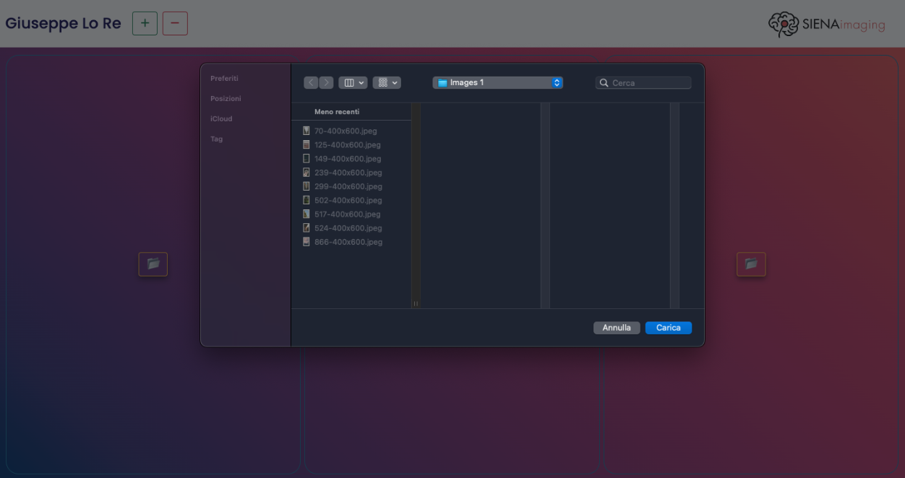
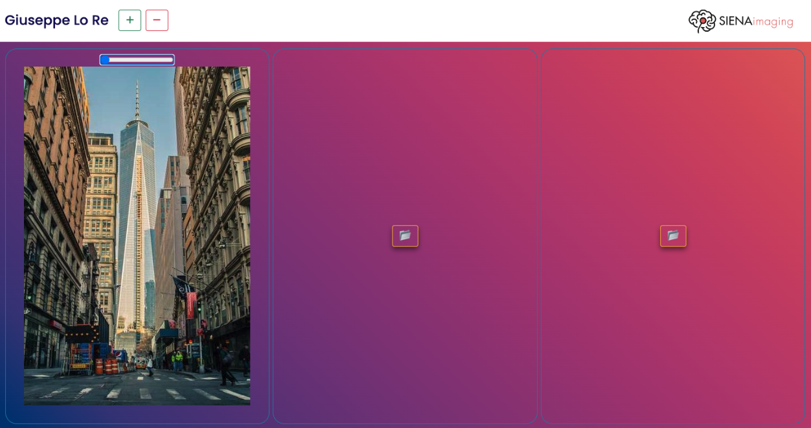
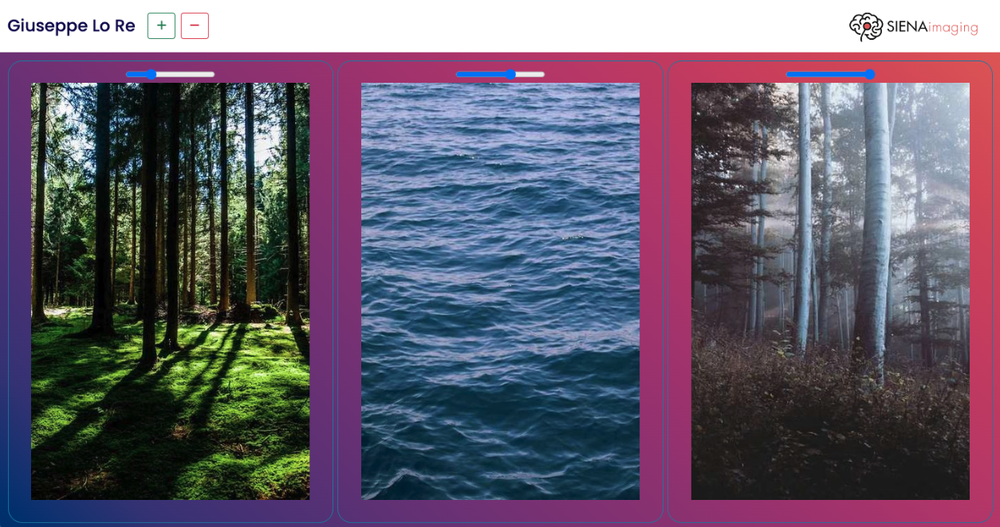
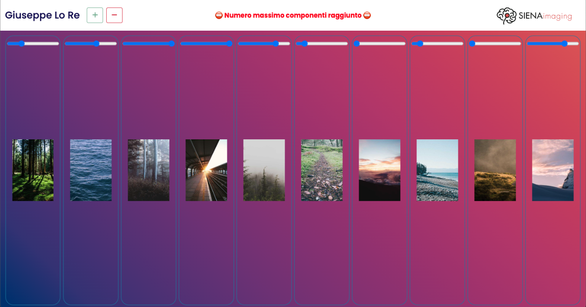
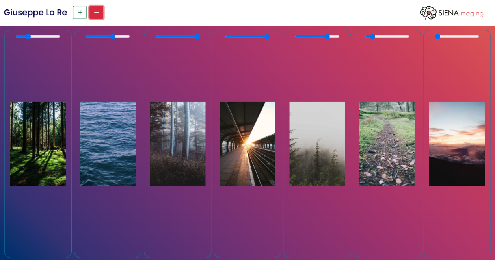
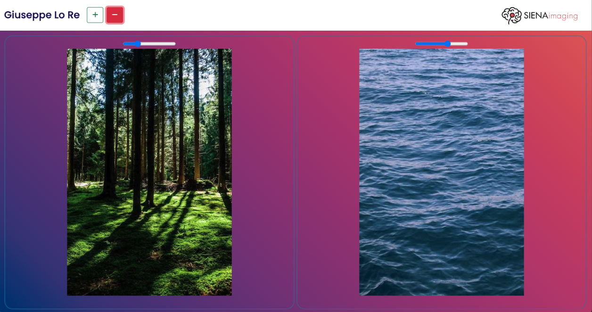

# Frontend Developer Position Second session TEST
***
***
## Table of Contents
1. [General Info](#general-info)
2. [Technologies](#technologies)
3. [Installation](#installation)
***
***
## Table of Contents
***
### General Info
Il progetto prevede lo sviluppo di una web app che permette all'utente di creare nella pagina diversi componenti(fino ad un limite massimo di 10 per scelta personale), all'interno di ognuno dei quali è possibile visualizzare delle immagini caricate dal proprio device.
***
***
### Screenshot

***
***
## Technologies
***
* [HTML]
* [CSS]
* [Javascript]
* [Bootstrap]
***
***
## Installation
***
Scaricare la repository ed aprire il file index.html.
***
***
## Logic used in the project
***
Ho deciso di utilizzare plain Javascript.
Al caricamento della pagina il pulsante "-" che rimuove i componenti dalla pagina è disabilitato.Inoltre viene settato un counter che terrà conto dei componenti presenti nella pagina.
***
- Add button
***
Al click sul button che aggiunge i componenti nella pagina il counter viene incrementato. Fin quando non sarà pari a 10, chiamerà la funzione AddCompoment, che si occupa della stampa. Al raggiungimento del limite, stamperà un messaggio nell'header, disabilitando il tasto stesso(Ho settato questo limite per scelta personale e resa estestica). 
***
- Remove button
***
Al click sul button che rimuove i componenti(abilitato solo dopo la creazione del primo) il messaggio scompare, viene descrementato il counter e chiamata la funzione removeComponent, che si occupa della rimozione. Se non sono presenti componenti nella pagina, il tasto stesso viene disabilitato.
***
- addComponent function
***
Crea il componente che sarà il contenitore di "insideComponent"(scelta fatta per gestire al meglio gli stili), che contiene al suo interno il button che permette all'utente di caricare la cartella delle immagini dal proprio device.
Al click sul button si aprirà la finestra per la selezione della directory di una  cartella, una scelta permessa.
Selezionata la cartella, i file presenti vengono filtrati per immagini e passati alla funzione renderImages, che si occupa di stampare le immagini in pagina.
***
- removeComponent function
***
Seleziona l'ultimo componente stampato e lo rimuove, seleziona tutti i restanti component e li passa alla funzione fitComponents, che gestische le proporzioni dei componenti in pagina.
***
- fitComponent function
***
Attraverso un ciclo ForEach, imposta la larghezza dei componenti, dividendo il 100% della stessa per il numero di componenti presenti, ricavato dal counter.
***
- renderImages function
***
Rimuove il button di upload dopo il click sullo stesso; crea un container per lo slider e lo stampa al suo interno, successivamente stampa il container dentro il componente. Attraverso un'iterazione pari alla numero di immagini presenti nella cartella selezionata, crea ogni singola immagine e la stampa dentro il componente.
Subito dopo vengono settati i parametri dello slider e, attraverso un'altra iterazione, viene resa visibile la prima immagine caricata e nascoste le altre.
Infine, il focus della pagina viene assegnato allo slider del componente appena stampato, che potrà essere utilizzato attraverso l'uso delle frecce sinistra e destra della tastiera. Ad ogni variazione dello slider, l'immagine visibile viene nascosta e mostrare quello successiva(o precedente, in base alla posizione dello stesso).